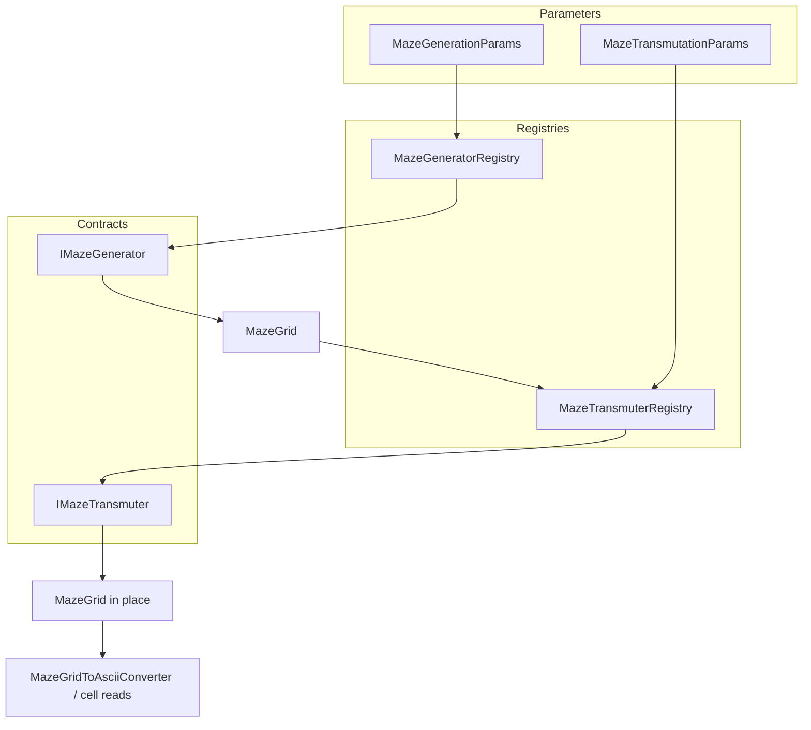
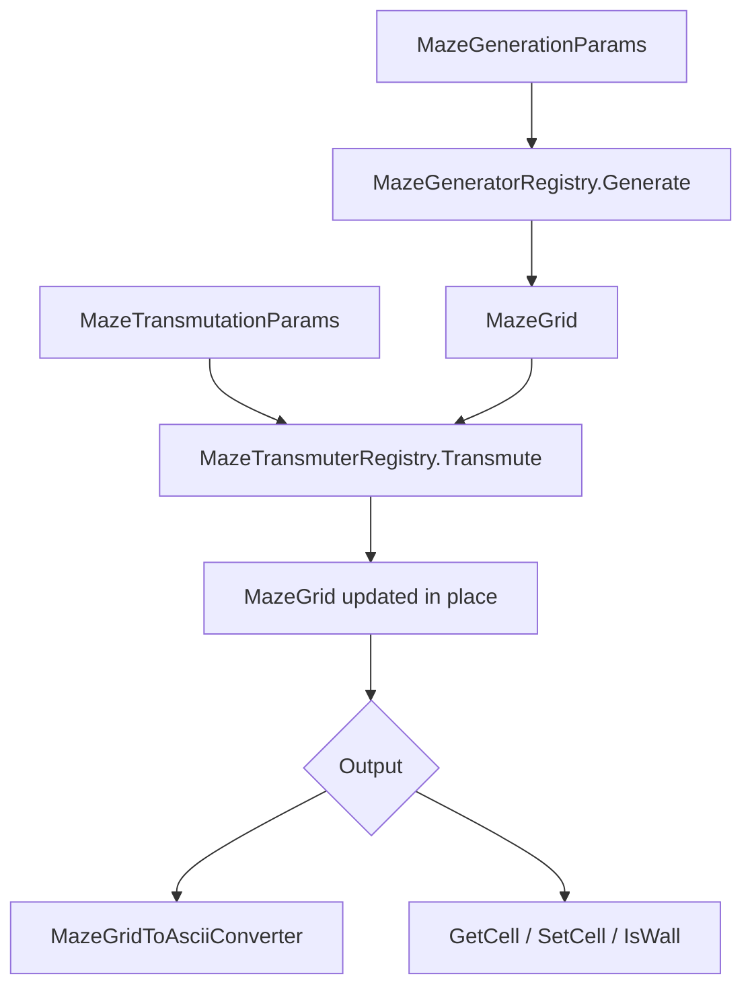
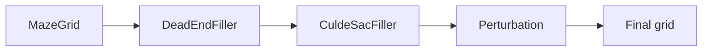
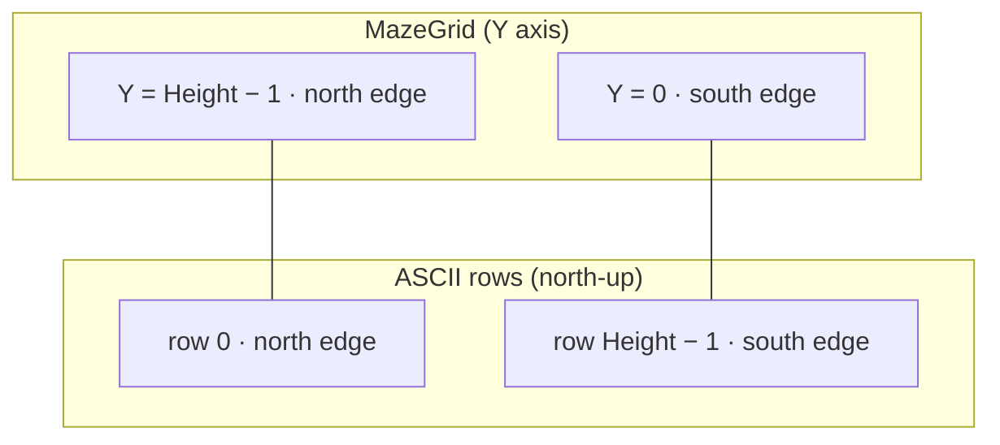
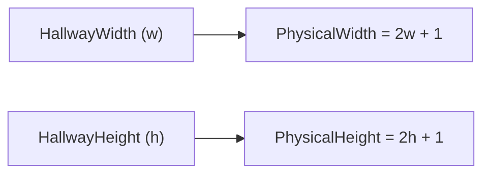
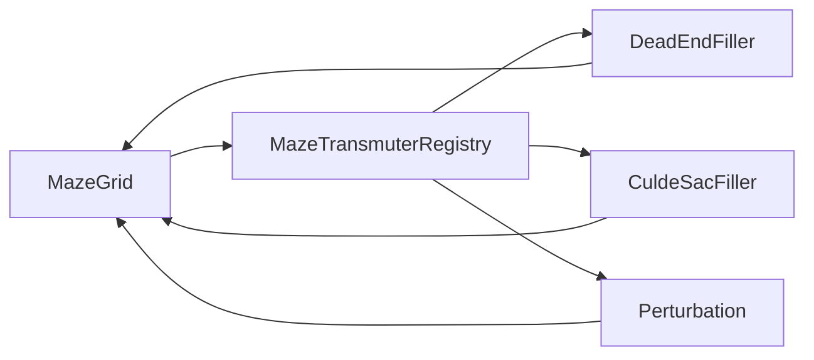

# Map generation (GridDungeon.Core)

Pure C# maze generation and post-processing for GridDungeon floors. Algorithms are ported from [mazelib](https://github.com/john-science/mazelib) (MIT) and exposed through registries so callers pick generators and transmuters by string id.

Namespace: `GridDungeon.Core.MapGeneration`

## Architecture



## Quick start

Generate a deterministic maze, optionally transmute it, then export ASCII for the floor editor or tests:

```csharp
using GridDungeon.Core.MapGeneration;

var genParams = new MazeGenerationParams
{
    Seed = 42,
    HallwayWidth = 10,
    HallwayHeight = 8,
    AlgorithmId = MazeGeneratorIds.Wilsons,
};

MazeGrid grid = MazeGeneratorRegistry.Generate(genParams);

MazeTransmuterRegistry.Transmute(
    grid,
    new MazeTransmutationParams
    {
        Seed = 42,
        TransmuterId = MazeTransmuterIds.DeadEndFiller,
        DeadEndIterations = 3,
    }
);

string ascii = MazeGridToAsciiConverter.ToAscii(grid);
// '#' = wall, '.' = open; rows are north-up (index 0 = north edge)
```

Requirements:

- `Seed` must be set on params objects that call `CreateSeededRandom()` (all built-in generators and transmuters).
- `HallwayWidth` and `HallwayHeight` are hallway **cell counts**, not physical tile counts (see [Grid sizing](#grid-sizing)).
- Minimum hallway dimension is **3** (`MazeGridSizing.MinHallwayDimension`).

## Pipeline



Transmuters modify the grid **in place**. Chain multiple transmuters in the order you want:



## Grid model

### `MazeGrid`

| Constant / member | Meaning |
|---|---|
| `MazeGrid.Wall` (`1`) | Impassable cell |
| `MazeGrid.Open` (`0`) | Walkable cell |
| `HallwayWidth`, `HallwayHeight` | Logical maze size (hallway cells) |
| `Width`, `Height` | Physical bitmap size in cells |

### Coordinates

- **Y = 0 is the south edge**; Y increases toward the north.
- ASCII export/import uses **north-up** rows: row 0 is the north edge, matching floor editor authoring.



### Grid sizing

Physical dimensions follow mazelib:



Hallway cells sit on odd coordinates; walls fill the even grid between them. `MazeGridSizing.TryGetLargestHallwayDimensionsForTargetPhysical` picks the largest `(w, h)` that fits a target floor bitmap.

Use `MazeGridSizing` to convert between hallway counts and physical size, or to fit a maze inside a target floor:

```csharp
if (MazeGridSizing.TryGetLargestHallwayDimensionsForTargetPhysical(
        targetWidth: 21,
        targetHeight: 17,
        out int w,
        out int h))
{
    // w, h are the largest hallway counts that fit
}
```

## Generators

Call via `MazeGeneratorRegistry.Generate(params)` or `TryGet(algorithmId, out IMazeGenerator)` for direct access.

| Id constant | `AlgorithmId` string | Notes |
|---|---|---|
| `MazeGeneratorIds.Prims` | `prims` | Classic minimum spanning tree maze |
| `MazeGeneratorIds.Backtracking` | `backtracking` | Recursive backtracker (default-style perfect maze) |
| `MazeGeneratorIds.Wilsons` | `wilsons` | Wilson's algorithm (uniform random spanning tree) |
| `MazeGeneratorIds.Kruskals` | `kruskals` | Kruskal's algorithm |
| `MazeGeneratorIds.Ellers` | `ellers` | Row-by-row; uses `XSkew`, `YSkew` (0–1) |
| `MazeGeneratorIds.GrowingTree` | `growing-tree` | Uses `BacktrackChance` (0–1) |
| `MazeGeneratorIds.HuntAndKill` | `hunt-and-kill` | Uses `HuntOrder` |
| `MazeGeneratorIds.Sidewinder` | `sidewinder` | Uses `SidewinderSkew` (0–1) |
| `MazeGeneratorIds.BinaryTree` | `binary-tree` | Uses `BinaryTreeSkew` (corner bias) |
| `MazeGeneratorIds.RecursiveDivision` | `recursive-division` | Room-and-divider style |
| `MazeGeneratorIds.AldousBroder` | `aldous-broder` | Random walk spanning tree |
| `MazeGeneratorIds.CellularAutomaton` | `cellular-automaton` | Cave-like; uses `CellularComplexity`, `CellularDensity` |
| `MazeGeneratorIds.DungeonRooms` | `dungeon-rooms` | Rooms + corridors; see below |

List registered ids at runtime:

```csharp
IReadOnlyCollection<string> ids = MazeGeneratorRegistry.RegisteredAlgorithmIds;
```

### Dungeon rooms

`DungeonRoomsMazeGenerator` connects rectangular rooms with corridors.

- **`Rooms`**: optional list of `MazeRoomRect` (inclusive bounds on the **physical** grid; corners should use odd coordinates). When null or empty, **2–4 random rooms** are placed.
- **`HuntOrder`**: `MazeDungeonHuntOrder.Random` or `Serpentine` (also used by Hunt-and-Kill).

Example with explicit rooms:

```csharp
var genParams = new MazeGenerationParams
{
    Seed = 1,
    HallwayWidth = 12,
    HallwayHeight = 10,
    AlgorithmId = MazeGeneratorIds.DungeonRooms,
    Rooms = new[]
    {
        new MazeRoomRect(minX: 1, minY: 1, maxX: 5, maxY: 5),
        new MazeRoomRect(minX: 9, minY: 9, maxX: 15, maxY: 13),
    },
    HuntOrder = MazeDungeonHuntOrder.Serpentine,
};
```

### Algorithm-specific parameters

All parameters live on `MazeGenerationParams`. Unused fields are ignored by algorithms that do not need them.

| Parameter | Used by |
|---|---|
| `BinaryTreeSkew` | Binary Tree |
| `SidewinderSkew` | Sidewinder |
| `BacktrackChance` | Growing Tree |
| `HuntOrder` | Hunt-and-Kill, Dungeon Rooms |
| `XSkew`, `YSkew` | Eller's |
| `CellularComplexity`, `CellularDensity` | Cellular Automaton |
| `Rooms` | Dungeon Rooms |

## Transmuters

Post-process an existing `MazeGrid` via `MazeTransmuterRegistry.Transmute(grid, params)`:



| Id constant | `TransmuterId` string | Effect |
|---|---|---|
| `MazeTransmuterIds.DeadEndFiller` | `dead-end-filler` | Removes dead ends (adds loops). `DeadEndIterations` (default 1). |
| `MazeTransmuterIds.CuldeSacFiller` | `cul-de-sac-filler` | Adds cul-de-sac loops along corridors. |
| `MazeTransmuterIds.Perturbation` | `perturbation` | Randomly adds walls and reconnects. `PerturbationRepeat`, `PerturbationNewWalls`. |

Protect entrance/goal cells during dead-end or loop fill:

```csharp
new MazeTransmutationParams
{
    Seed = 42,
    TransmuterId = MazeTransmuterIds.DeadEndFiller,
    StartX = 1,
    StartY = 1,
    EndX = 19,
    EndY = 15,
};
```

Coordinates are **physical grid** cells (same as `MazeGrid.GetCell` / `SetCell`).

## ASCII import and export

**Export** (for display, floor editor rows, or golden tests):

```csharp
string text = MazeGridToAsciiConverter.ToAscii(grid);
string[] rowsNorthUp = MazeGridToAsciiConverter.ToAsciiRows(grid);
```

**Import** (from editor rows or hand-authored layouts):

```csharp
MazeGrid grid = MazeAsciiGridConverter.FromNorthUpRows(new[]
{
    "#########",
    "#...#...#",
    "#.#.#.#.#",
    "#########",
});
```

Default characters: `#` wall, `.` open. Override with `wallChar` / `openChar` parameters.

## Custom generators and transmuters

Implement `IMazeGenerator` or `IMazeTransmuter`, then register:

```csharp
MazeGeneratorRegistry.Register(new MyCustomGenerator());
MazeTransmuterRegistry.Register(new MyCustomTransmuter());
```

Built-in algorithms register in static constructors on first use of each registry.

### Unity domain reload

In Unity, static state resets on domain reload. Game/Editor code that relies on the registries should re-register custom entries after reload, e.g. with `[RuntimeInitializeOnLoadMethod(RuntimeInitializeLoadType.SubsystemRegistration)]` (see comment on `MazeGeneratorRegistry`).

## Extending the library


New algorithms belong in **griddungeon-game** `Assets/Scripts/Core/MapGeneration/`, then sync to this mirror:

```powershell
./scripts/sync-from-game.ps1
dotnet build GridDungeon.Core.sln -c Release
```

Add ids to `MazeGeneratorIds` or `MazeTransmuterIds` and register implementations in the corresponding registry static constructor.

## Attribution

Maze algorithms and transmuters are adapted from [mazelib](https://github.com/john-science/mazelib) (MIT). Individual source files link to the corresponding Python modules.
